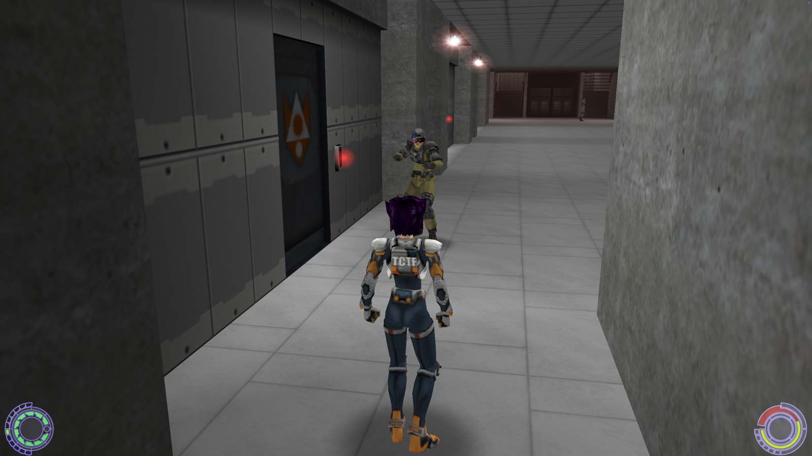
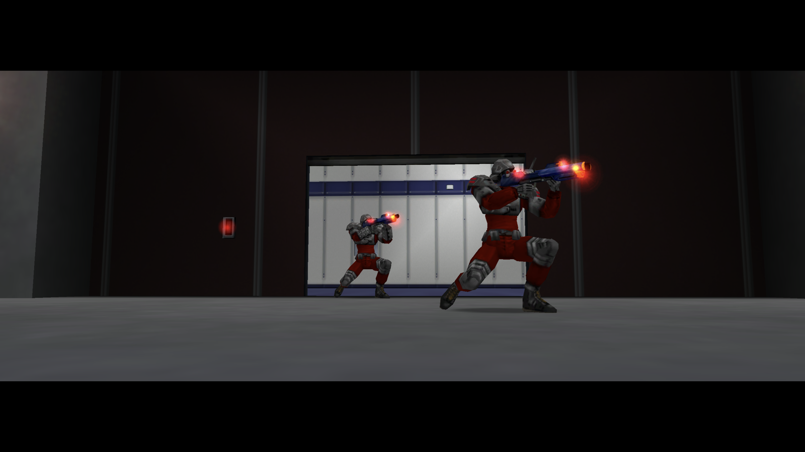
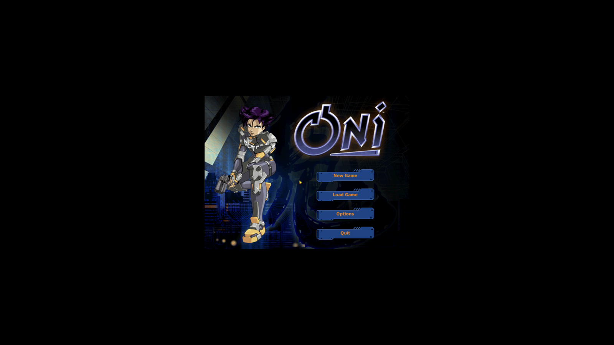
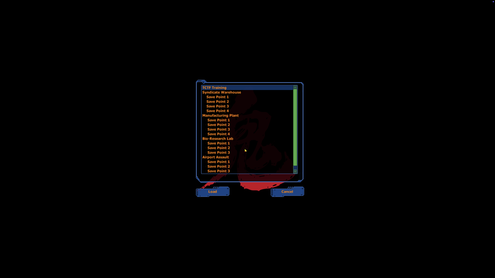

<div align="center">


# OniARM64

*A native Apple Silicon port of Bungie's Oni (2001).*

 &nbsp;
 &nbsp;
 &nbsp;


</div>

---

## Get it running

### Download a build

1. Grab the latest `OniARM64.dmg` from [Releases](https://github.com/andiyar/OniARM64/releases).
2. Open the DMG and drag `OniARM64.app` onto the `Applications` shortcut.
3. Drop your Oni `GameDataFolder` at `~/Library/Application Support/OniARM64/gamedata/` (or symlink it).
4. Double-click `OniARM64.app` to launch. Signed + notarized with Apple — no Gatekeeper warnings, no right-click workaround needed.

### Build from source

```sh
cd build && cmake .. -DPlatform_SDL=ON && make -j8 oni_app
ln -sfn /path/to/your/Oni/GameDataFolder ~/Library/Application\ Support/OniARM64/gamedata
open build/bin/OniARM64.app
```

No Oni game data is included in the source or the app bundle. BYO.

---

## Screenshots

<table>
<tr>
<td align="center"><br/><sub><b>Third-person gameplay</b> — levels 1–4 play start to finish</sub></td>
<td align="center"><br/><sub><b>Combat</b> — AI, weapons, particle effects</sub></td>
</tr>
<tr>
<td align="center"><br/><sub><b>Main menu</b> — running natively on Apple Silicon</sub></td>
<td align="center"><br/><sub><b>Save / load</b> across the playable levels</sub></td>
</tr>
</table>

---

## Status

Levels 1–4 playable end-to-end — combat, AI, weapons, particle effects, save/load all working. Phases 1, 2, 3, and 5 complete. Phases 4 (audio + effects) and 6 (gameplay completion) partial; levels 5–14 haven't been driven through yet.

<details>
<summary><strong>Full milestone status</strong></summary>

### Phase 1 — Boot & init ✅
- [x] Builds as native ARM64 binary on Apple Silicon
- [x] All subsystems initialise end-to-end without SIGSEGV
- [x] Crash handler prevents zombie processes after a SIGSEGV

### Phase 2 — Render & UI ✅
- [x] Main menu renders and is interactive
- [x] HiDPI viewport scaling — game renders fullscreen, mouse aligned
- [x] Multi-frame rendering without geometry corruption
- [x] Characters render with correct bone transforms
- [x] In-game UI text renders without left-edge clipping

### Phase 3 — Level load & gameplay primitives ✅
- [x] Level 0 (main menu) loads and runs
- [x] Level 1 (tutorial / warehouse) loads from New Game
- [x] Movement (WASD / mouselook) works without crashing
- [x] Doors open in response to triggers
- [x] Trigger volumes fire scripted events
- [x] AI state machines run without crashing
- [x] Resolution / window-size persists across launches

### Phase 4 — Audio & effects
- [x] Menu / cutscene / dialogue audio plays
- [x] Footstep impact sounds play
- [ ] Particle classes load without size-class overflow
- [x] Security-laser tripwire beams render in the tutorial level

### Phase 5 — AI behaviour ✅
- [x] NPCs detect the player via sight and sound (Knowledge layer)
- [x] NPCs escalate alert → combat
- [x] AI combat behaviour fires (melee + ranged)
- [x] NPCs close distance to engage the player
- [x] Scripted NPC movement (patrol paths) executes
- [x] NPC-vs-NPC combat completes to first kill; surviving NPCs re-target

### Phase 6 — Gameplay completion
- [x] Konoko engages NPCs in combat end-to-end across a full encounter
- [x] Tutorial level completable to next-level transition
- [x] Save / load works across runs
- [x] Levels 2–4 playable with particle effects, combat, AI, level transitions
- [ ] All 14 levels playable

### Phase 7 — Shippable artefact
- [x] `.app` bundle + code signing
- [ ] Anniversary Edition fixes (dev mode, widescreen, FPS smoothing, texture packs)

</details>

---

## Why this exists

*Oni* is the action-brawler Bungie shipped in January 2001 — third-person hand-to-hand and gunplay, an anime-inflected sci-fi police state, a story by Hideyuki Tanaka. It was Bungie's last solo release before Microsoft acquired them for Halo. The Windows and Mac builds shipped together; the Mac build stopped working when Apple killed 32-bit apps in macOS Catalina (2019).

This is the Apple Silicon branch. It picks up from Bungie's 2001 source release (via the [hogsy/OniFoxed](https://github.com/hogsy/OniFoxed) fork that kept it building) and gets Oni running natively on M-series Macs — same game, no Wine, no virtualisation, no Rosetta. Significant divergence from upstream: rewritten window-manager message API, template-manager bridge layer, memory allocator, OpenAL init, and dozens of 32→64 pointer sites.

Personal project. I'm porting it because I want to play Oni on my own Mac. Issues welcome; no roadmap.

---

## Build details

| File | Location |
| --- | --- |
| Game data lookup | `~/Library/Application Support/OniARM64/gamedata/` → `<bundle>/Contents/Resources/gamedata/` → legacy cwd-relative search |
| `persist.dat`, `key_config.txt` | `~/Library/Application Support/OniARM64/` (cwd-relative if it already exists, else here) |
| `startup.txt`, `debugger.txt` | `~/Library/Logs/OniARM64/` (cwd-relative if writable, else here) |
| Crash reports | `~/Library/Logs/DiagnosticReports/Oni-*.ips` (macOS default) |

Common env vars:

- `SDL_VIDEO_ALLOW_SCREENSAVER=1` — belt-and-braces against leaked display-sleep assertions.
- `ONI_AUTOSTART=1` — skips the main menu and jumps straight to level 1.

> **Bare-binary workflow** (faster inner loop for hacking): drop `build/bin/Oni` into a directory containing a `GameDataFolder` symlink and run there. State files land next to the binary. Still works; the `.app` workflow above is the default.

---

## Building a release

For producing the signed + notarized + stapled `OniARM64.dmg` that ships to [Releases](https://github.com/andiyar/OniARM64/releases). Maintainer workflow — most contributors will never need this.

<details>
<summary><strong>Setup + per-release commands</strong></summary>

Extra dep:

```sh
brew install create-dmg
```

One-time keychain setup (notarization credentials). App-specific password from https://appleid.apple.com/account/manage → Sign-In and Security → App-Specific Passwords:

```sh
xcrun notarytool store-credentials oniarm64-notarize \
    --apple-id "<your-apple-id>" \
    --team-id "<your-team-id>" \
    --password "<app-specific-password>"
```

One-time CMake configure (signing identity). Discover yours with `security find-identity -v -p codesigning`:

```sh
cmake .. -DPlatform_SDL=ON \
    -DONI_SIGN_IDENTITY="Developer ID Application: Your Name (TEAMID)"
```

Per-release build:

```sh
make oni_app_release
# Produces build/OniARM64.dmg — signed, notarized, stapled, drag-to-Applications.
# Takes ~7 min total (two Apple notary round-trips: ~3min for the .app, ~2min for the DMG).
```

**Recovery:** if `notarytool submit` returns `Invalid`, fetch the rejection log with `xcrun notarytool log <submission-id> --keychain-profile oniarm64-notarize`.

**Known flake:** `create-dmg` occasionally errors on first run with cryptic `hdiutil` warnings — it wraps `hdiutil` + AppleScript and Finder state matters. Re-run `make oni_app_release`; usually succeeds the second time.

Publish the DMG as a GitHub Release using the notes template:

```sh
cp macos/RELEASE_NOTES_TEMPLATE.md /tmp/oni-release-notes.md
# edit /tmp/oni-release-notes.md: fill placeholders, append a new line
# to the Version history, refresh What works
git tag -a v<VERSION> -m "Oni <VERSION>"
git push origin v<VERSION>
gh release create v<VERSION> --repo andiyar/OniARM64 \
    --title "Oni <VERSION> — <SHORT-TAGLINE>" \
    --notes-file /tmp/oni-release-notes.md \
    --prerelease \
    build/OniARM64.dmg
```

</details>

---

## Contributing

Issues welcome. No roadmap.

- [Open issues](https://github.com/andiyar/OniARM64/issues)
- [Development history (HISTORY.md)](HISTORY.md)

---

## Credits

- **Bungie** — original game (2001), source release, asset formats. Shipped the original Mac PPC build alongside Windows.
- **The Omni Group** — 2001–2007 PowerPC OS X port (Oni 1.0 v1.36, Ken Case et al.). Designed the "O" Mac app icon used by every Mac build since.
- **[Feral Interactive](https://www.feralinteractive.com/)** — 2008–2015 Intel macOS port (Oni 1.1 Intel → 1.2 → 1.2.1). The `Oni.icns` packaging, intro/outro QuickTime cinematics, and `Info.plist` template lifted into this build are from their 1.2.1 binary.
- **[hogsy/OniFoxed](https://github.com/hogsy/OniFoxed)** — upstream fork this branched from; kept the 2001 source release building on modern systems.
- **[Iritscen](https://iritscen.oni2.net/)** — Anniversary Edition project, [Oni Mod Depot](https://mods.oni2.net/), and a lot of the community tooling and documentation we leaned on.
- **[oni2.net community](https://oni2.net/)** — OniSplit / OUP / Daodan reverse engineering. `wiki.oni2.net` / `oni.bungie.org` forums are the canonical Oni-modding reference.

---

## Bundled third-party software

The downloadable `.app` ships with these libraries in `Contents/Frameworks/`, each ad-hoc re-signed alongside the binary:

| Component | License | Project |
| --- | --- | --- |
| SDL2 | Zlib | [libsdl.org](https://libsdl.org) |
| FFmpeg (`libavcodec` + `libavutil`, ADPCM_MS decoder only) | LGPL-2.1-or-later | [ffmpeg.org](https://ffmpeg.org) |

FFmpeg is built from source via `scripts/build-ffmpeg.sh` with `--disable-gpl --disable-nonfree --disable-everything --enable-decoder=adpcm_ms` and a long list of explicit `--disable-*` flags — only the minimum needed to decode Oni's Microsoft-ADPCM-encoded sound data. None of x264, x265, libvpx, dav1d, SVT-AV1, mp3lame, Opus, OpenSSL, or any other Homebrew transitive dep ends up in the bundle. Full license texts are in [THIRD_PARTY_LICENSES.md](THIRD_PARTY_LICENSES.md) and shipped as `Contents/Resources/THIRD_PARTY_LICENSES.txt` inside the bundle.

The `Build from source` path picks up the same minimal ffmpeg from `extern/ffmpeg/` (built by the script on first run), with a fallback to Homebrew's `ffmpeg` if `extern/ffmpeg/` doesn't exist — handy for quick dev iteration where the bundle isn't being produced.

---

<sub><em>Oni © 2001 Bungie / Take-Two Interactive. Fan port of the 2001 source release. Not affiliated with Bungie or Take-Two.</em></sub>
