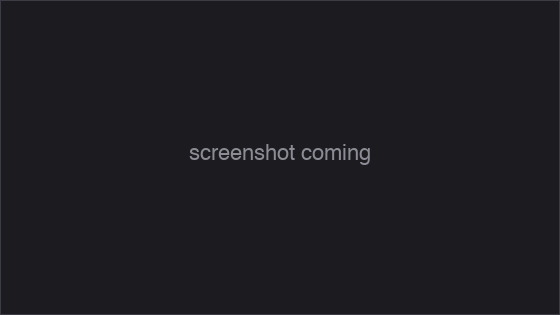

<div align="center">


# OniARM64

*A native Apple Silicon port of Bungie's Oni (2001).*

 &nbsp;
 &nbsp;
 &nbsp;


</div>

---

## Get it running

### Download a build

1. Grab the latest `OniARM64.dmg` from [Releases](https://github.com/andiyar/OniARM64/releases).
2. Open the DMG and drag `OniARM64.app` onto the `Applications` shortcut.
3. Drop your Oni `GameDataFolder` at `~/Library/Application Support/OniARM64/gamedata/` (or symlink it).
4. Double-click `OniARM64.app` to launch. Signed + notarized with Apple — no Gatekeeper warnings, no right-click workaround needed.

### Build from source

```sh
cd build && cmake .. -DPlatform_SDL=ON && make -j8 oni_app
ln -sfn /path/to/your/Oni/GameDataFolder ~/Library/Application\ Support/OniARM64/gamedata
open build/bin/OniARM64.app
```

You supply your own Oni data files. None ship here.

---

## Screenshots

<table>
<tr>
<td></td>
<td></td>
<td></td>
</tr>
</table>

---

## Status

Levels 1 (tutorial) and 2 (warehouse) playable end-to-end — combat, AI, weapons, save/load all working. Phases 1, 2, 3, and 5 complete. Phases 4 (audio + effects) and 6 (gameplay completion) partial; the other 12 levels haven't been driven through yet.

<details>
<summary><strong>Full milestone status</strong></summary>

### Phase 1 — Boot & init ✅
- [x] Builds as native ARM64 binary on Apple Silicon
- [x] All subsystems initialise end-to-end without SIGSEGV
- [x] Crash handler prevents zombie processes after a SIGSEGV

### Phase 2 — Render & UI ✅
- [x] Main menu renders and is interactive
- [x] HiDPI viewport scaling — game renders fullscreen, mouse aligned
- [x] Multi-frame rendering without geometry corruption
- [x] Characters render with correct bone transforms
- [x] In-game UI text renders without left-edge clipping

### Phase 3 — Level load & gameplay primitives ✅
- [x] Level 0 (main menu) loads and runs
- [x] Level 1 (tutorial / warehouse) loads from New Game
- [x] Movement (WASD / mouselook) works without crashing
- [x] Doors open in response to triggers
- [x] Trigger volumes fire scripted events
- [x] AI state machines run without crashing
- [x] Resolution / window-size persists across launches

### Phase 4 — Audio & effects
- [x] Menu / cutscene / dialogue audio plays
- [x] Footstep impact sounds play
- [ ] Particle classes load without size-class overflow
- [x] Security-laser tripwire beams render in the tutorial level

### Phase 5 — AI behaviour ✅
- [x] NPCs detect the player via sight and sound (Knowledge layer)
- [x] NPCs escalate alert → combat
- [x] AI combat behaviour fires (melee + ranged)
- [x] NPCs close distance to engage the player
- [x] Scripted NPC movement (patrol paths) executes
- [x] NPC-vs-NPC combat completes to first kill; surviving NPCs re-target

### Phase 6 — Gameplay completion
- [x] Konoko engages NPCs in combat end-to-end across a full encounter
- [x] Tutorial level completable to next-level transition
- [x] Save / load works across runs
- [ ] All 14 levels playable

### Phase 7 — Shippable artefact
- [x] `.app` bundle + code signing
- [ ] Anniversary Edition fixes (dev mode, widescreen, FPS smoothing, texture packs)

</details>

---

## Why this exists

*Oni* is the action-brawler Bungie shipped in January 2001 — third-person hand-to-hand and gunplay, an anime-inflected sci-fi police state, a story by Hideyuki Tanaka. It was Bungie's last solo release before Microsoft acquired them for Halo. The Windows and Mac builds shipped together; the Mac build stopped working when Apple killed 32-bit apps in macOS Catalina (2019).

This is the Apple Silicon branch. It picks up from Bungie's 2001 source release (via the [hogsy/OniFoxed](https://github.com/hogsy/OniFoxed) fork that kept it building) and gets Oni running natively on M-series Macs — same game, no Wine, no virtualisation, no Rosetta. Significant divergence from upstream: rewritten window-manager message API, template-manager bridge layer, memory allocator, OpenAL init, and dozens of 32→64 pointer sites.

Personal project. I'm porting it because I want to play Oni on my own Mac. Issues welcome; no roadmap.

---

## Build details

| File | Location |
| --- | --- |
| Game data lookup | `~/Library/Application Support/OniARM64/gamedata/` → `<bundle>/Contents/Resources/gamedata/` → legacy cwd-relative search |
| `persist.dat`, `key_config.txt` | `~/Library/Application Support/OniARM64/` (cwd-relative if it already exists, else here) |
| `startup.txt`, `debugger.txt` | `~/Library/Logs/OniARM64/` (cwd-relative if writable, else here) |
| Crash reports | `~/Library/Logs/DiagnosticReports/Oni-*.ips` (macOS default) |

Common env vars:

- `SDL_VIDEO_ALLOW_SCREENSAVER=1` — belt-and-braces against leaked display-sleep assertions.
- `ONI_AUTOSTART=1` — skips the main menu and jumps straight to level 1.

> **Bare-binary workflow** (faster inner loop for hacking): drop `build/bin/Oni` into a directory containing a `GameDataFolder` symlink and run there. State files land next to the binary. Still works; the `.app` workflow above is the default.

---

## Building a release

For producing the signed + notarized + stapled `OniARM64.dmg` that ships to [Releases](https://github.com/andiyar/OniARM64/releases). Maintainer workflow — most contributors will never need this.

<details>
<summary><strong>Setup + per-release commands</strong></summary>

Extra dep:

```sh
brew install create-dmg
```

One-time keychain setup (notarization credentials). App-specific password from https://appleid.apple.com/account/manage → Sign-In and Security → App-Specific Passwords:

```sh
xcrun notarytool store-credentials oniarm64-notarize \
    --apple-id "<your-apple-id>" \
    --team-id "<your-team-id>" \
    --password "<app-specific-password>"
```

One-time CMake configure (signing identity). Discover yours with `security find-identity -v -p codesigning`:

```sh
cmake .. -DPlatform_SDL=ON \
    -DONI_SIGN_IDENTITY="Developer ID Application: Your Name (TEAMID)"
```

Per-release build:

```sh
make oni_app_release
# Produces build/OniARM64.dmg — signed, notarized, stapled, drag-to-Applications.
# Takes ~7 min total (two Apple notary round-trips: ~3min for the .app, ~2min for the DMG).
```

**Recovery:** if `notarytool submit` returns `Invalid`, fetch the rejection log with `xcrun notarytool log <submission-id> --keychain-profile oniarm64-notarize`.

**Known flake:** `create-dmg` occasionally errors on first run with cryptic `hdiutil` warnings — it wraps `hdiutil` + AppleScript and Finder state matters. Re-run `make oni_app_release`; usually succeeds the second time.

</details>

---

## Contributing

Issues welcome. No roadmap.

- [Open issues](https://github.com/andiyar/OniARM64/issues)
- [Development history (HISTORY.md)](HISTORY.md)

---

## Credits

- **Bungie** — original game (2001), source release, asset formats
- **[hogsy/OniFoxed](https://github.com/hogsy/OniFoxed)** — upstream fork this branched from
- **godgames** — 2014 Intel macOS port; canonical `Oni.icns`, QuickTime intro/outro cinematics, `Info.plist` template
- **[oni2.net community](https://oni2.net/)** — OniSplit / OUP / Daodan reverse engineering

---

## Bundled third-party software

The downloadable `.app` ships with these libraries (Homebrew dylibs copied into `Contents/Frameworks/` and re-signed):

| Component | License | Project |
| --- | --- | --- |
| SDL2 | zlib | [libsdl.org](https://libsdl.org) |
| FFmpeg (`libavcodec` / `libavutil` / `libswresample`) | LGPL-2.1-or-later | [ffmpeg.org](https://ffmpeg.org) |
| LAME (`libmp3lame`) | LGPL-2.0-or-later | [LAME](https://lame.sourceforge.io/) |
| Opus (`libopus`) | BSD-3-Clause | [opus-codec.org](https://opus-codec.org/) |
| libvpx | BSD-3-Clause | [WebM Project](https://www.webmproject.org/code/) |
| dav1d (`libdav1d`) | BSD-2-Clause | [VideoLAN](https://www.videolan.org/projects/dav1d.html) |
| SVT-AV1 (`libSvtAv1Enc`) | BSD-3-Clause-Clear + AV1 patent terms | [Alliance for Open Media](https://aomedia.org/) |
| OpenSSL 3 (`libcrypto` / `libssl`) | Apache-2.0 | [openssl.org](https://www.openssl.org) |
| x264 ⚠️ | GPL-2.0-or-later | [VideoLAN](https://www.videolan.org/developers/x264.html) |
| x265 ⚠️ | GPL-2.0-or-later | [x265.org](http://x265.org/) |

⚠️ The bundle currently includes **x264** and **x265** (transitive deps of Homebrew's GPL-enabled ffmpeg build). Oni doesn't *use* them — it only decodes the intro/outro `.mov` files, no H.264/H.265 encoding — but their presence in the redistributed binary makes the combined work subject to GPL terms. Tracking the strip / move-to-AVFoundation cleanup in [#19](https://github.com/andiyar/OniARM64/issues/19).

Source for each library is at the upstream project links above. The build-from-source path uses your own Homebrew installs; nothing is bundled there.

---

<sub><em>Oni © 2001 Bungie / Take-Two Interactive. Fan port of the 2001 source release. Not affiliated with Bungie or Take-Two.</em></sub>
